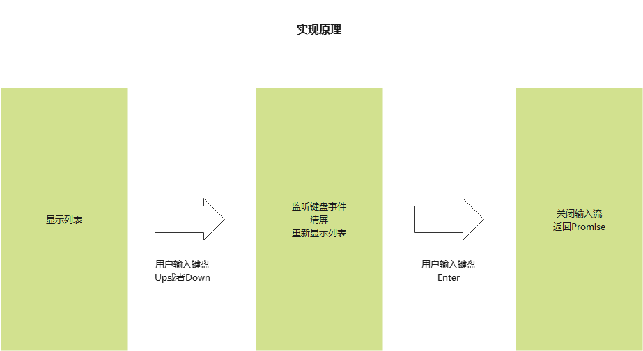

# inquirer 命令行交互原理

## readline 的使用方法和实现原理



### 使用

```javascript
const readline = require('readline');

const rl = readline.createInterface({
  input: process.stdin,
  output: process.stdout,
});

rl.question('your name:', (answer) => {
  console.log('your name:', answer);
  rl.close();
});
```

### readline 源码分析

- 强制将函数转换为构造函数

```javascript
if (!this instanceof Interface()) {
  return new Interface(input, output, completer, terminal);
}
```

- 获得事件驱动的能力

```javascript
EventEmitter.call(this);
```

- 监听键盘事件

### 手写 readline 核心实现

```javascript
// stepread.js
function stepRead(callback) {
  function onkeypress(s) {
    outpout.write(s);
    line += s;
    switch (s) {
      case '\r':
        input.pause();
        callback(line);
        break;

      default:
        break;
    }
  }
  const input = process.stdin;
  const outpout = process.stdout;
  let line = '';

  emitKeypressEvents(input);
  input.on('keypress', onkeypress);
  input.setRawMode(true);
  input.resume();
}

function emitKeypressEvents(stream) {
  function onData(chunk) {
    g.next(chunk.toString());
  }
  const g = emitKeys(stream);
  g.next();

  stream.on('data', onData);
}

function* emitKeys(stream) {
  while (true) {
    let ch = yield;
    stream.emit('keypress', ch);
  }
}

stepRead((s) => {
  console.log('answer:', s);
});
```

## ansi 转义序列

```javascript
// ansi.js
console.log('\x1B[41m%s\x1B[0m', 'your name:');
console.log('\x1B[2B%s', 'your name2:');
console.log('\x1B[10G%s', 'your name3:');
```

## 响应式库 rxjs

```javascript
// rxjs
import { range } from 'rxjs';
import { map, filter } from 'rxjs/operators';

range(1, 200)
  .pipe(
    filter((x) => x % 2 === 1),
    map((x) => x + x),
  )
  .subscribe((x) => console.log(x));
```

## 手写命令行交互式列表组件


```javascript
// list.js;
```
